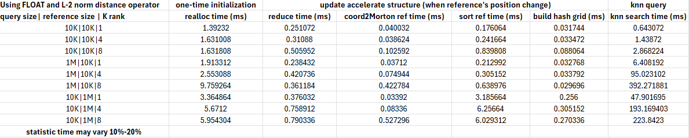

# cuda_morton_optimized_simple_knn
cuda_morton_optimized_simple_knn, see https://gitlab.inria.fr/bkerbl/simple-knn, this version can return pt_index and pt_distance_sqr for each query. You can simply modified to add more general distance operater (default is L2).

For the sample usage, see sample.cu
## Benchmark
Target platform: Nvidia RTX 4090, CUDA 12.6, sm=89

